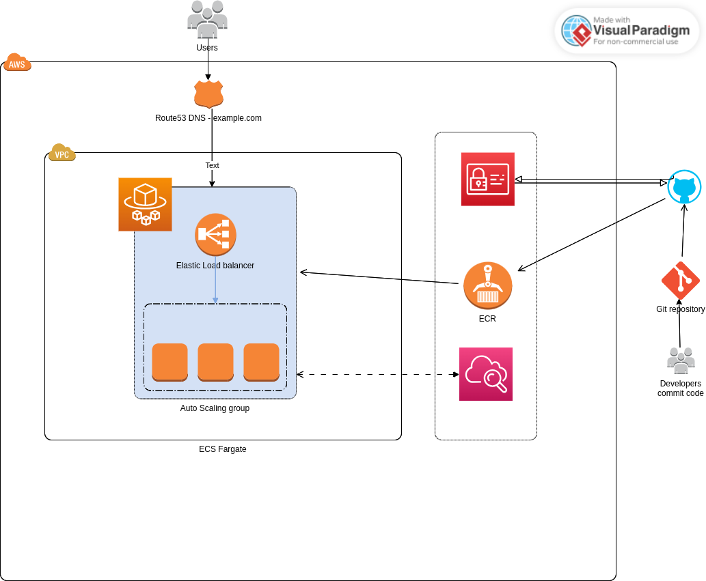

# Atividade proposta e decisão de arquitetura.
A atividade proposta foi criar apenas uma ambiente para hospedar a aplicação NodeJS, por isso não foi avaliado a criação de armazenamento externo, seja S3, Amazon RDS ou Amazon DynamoDB. então o escopo foi limitado ao serviços de amazon Route 53, para resolver o DNS, um ambiente Amazon ECS fargate e Amazon Elastic Container Registry(ECR), Descidir usar o Github Actions para fazer build da imagem da aplicação NodeJs e registar a imagem no ECR. E por fim, para aproveitar recursos da nuvem aws decidi me deter ao monitoramento usando o  AWS CloudWatch.

# Arquitetura de Aplicação NodeJS no AWS Fargate

## CI/CD com GitHub Actions

GitHub Actions é utilizado para automatizar o ciclo de vida do desenvolvimento de software, desde o build até o deploy. Nesta arquitetura, o GitHub Actions executa dois papéis principais:

1. **Build da Imagem Docker**: A cada commit na branch `main`, o GitHub Actions é acionado para construir uma imagem Docker a partir do repositório. Este processo garante que qualquer atualização no código seja imediatamente refletida na nova imagem criada.
   
2. **Deploy no AWS ECR**: Após o sucesso do build, a imagem é automaticamente enviada para o **Amazon Elastic Container Registry (ECR)**. O ECR serve como um repositório de imagens Docker, permitindo versionamento e armazenamento seguro.

A escolha do GitHub Actions para estas tarefas se justifica pela sua integração direta com o GitHub, facilitando a implementação de pipelines de CI/CD diretamente do repositório de código, sem a necessidade de ferramentas externas.

## Deploy e Execução com AWS Fargate

O **AWS Fargate** é um serviço de orquestração de contêineres que permite rodar aplicações sem gerenciar servidores ou clusters. Após o build e o registro da imagem Docker no ECR, o Fargate é responsável por:

- Orquestrar o deploy da aplicação utilizando a imagem armazenada no ECR.
- Escalar automaticamente a aplicação sem a necessidade de gerenciar a infraestrutura subjacente.
- Manter a alta disponibilidade e segurança da aplicação.

A escolha do Fargate para execução de contêineres elimina a complexidade operacional e permite que desenvolvedores se concentrem apenas no código, não na infraestrutura.

## Monitoramento com AWS CloudWatch

O **AWS CloudWatch** é utilizado para monitorar e observar a aplicação em tempo real. Ele coleta métricas e logs que são essenciais para entender o comportamento da aplicação. Os principais elementos monitorados incluem:

- **Métricas de Utilização**: Como CPU e memória utilizada pelos contêineres.
- **Logs de Aplicações**: Saída dos logs gerados pela aplicação NodeJS e pela infraestrutura AWS.
- **Alertas**: Configuração de alarmes baseados em métricas específicas que notificam os desenvolvedores sobre problemas potenciais ou reais.

A integração do CloudWatch com o Fargate permite uma visão detalhada da performance e saúde da aplicação, facilitando a detecção precoce de problemas e a resposta rápida para manutenção da estabilidade operacional
